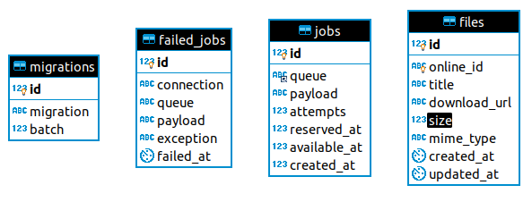

## Simple File Browser
This simple project have two buttons, one to sync with google drive and another one to list file locally.

Note: This is simple so there is cases like deleting from google drive manually or update files(Should be included in project)
## Basic Concept
Sync:
* Making Google Drive Service to get all files.
* Making Action to store data to db.
* Using Queue job to sync data between drive and locally.
Files:
    -List all files using pagination.

## Steps to run project
* Clone project.
* rename .env.example to .env.
* Composer install
* `php artisan key:generate`
* Use ur own google drive credentials and file below fields within .env:
    * `GOOGLE_APP_ID=`
    * `GOOGLE_CLIENT_ID=`
    * `GOOGLE_CLIENT_SECRET=`
    * `GOOGLE_DRIVE_REFRESH_TOKEN=`
    * `GOOGLE_REDIRECT=`
* Create a new mysql db and get ur connection parameters.
* Fill mysql connection parameters within env.
* `php artisan migrate`
* `php artisan serve`
* Don't forget to run a worker to execute the jobs:
    * `php artisan queue:work`

## DB Schema Simple Table To hold file's data
* online_id (string to holde unique files id) to search for before storing to avoid duplicate entries.
* title (string to hold file's name)
* download_url (string to hold file's webContentUrl)
* size (unsignedint to hold file's size in kb)
* mime_type (string to hold file's mimeType)

